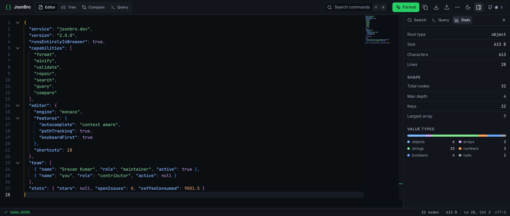

<div align="center">

# JsonBro

**A keyboard-first JSON workbench that runs entirely in your browser.**

Format, validate, repair, search, query, browse and diff JSON — without a single byte
leaving your machine.

[](https://jsonbro.dev)

[](https://github.com/sravand123/jsonbro.dev/actions/workflows/deploy.yml)
[](LICENSE)
[](https://react.dev)
[](https://www.typescriptlang.org)
[](http://makeapullrequest.com)



</div>

## Contents

- [Why this exists](#why-this-exists)
- [Features](#features)
- [JSONPath reference](#jsonpath-reference)
- [Keyboard shortcuts](#keyboard-shortcuts)
- [Getting started](#getting-started)
- [Project scripts](#project-scripts)
- [Architecture](#architecture)
- [Testing and quality gates](#testing-and-quality-gates)
- [Performance and bundle budget](#performance-and-bundle-budget)
- [Privacy and data handling](#privacy-and-data-handling)
- [Known limitations](#known-limitations)
- [Browser support](#browser-support)
- [Deployment](#deployment)
- [Contributing](#contributing)
- [License](#license)

## Why this exists

Most online JSON tools ask you to paste data into someone else's server, then hand back
`Unexpected token } in JSON at position 1247` when something is wrong. JsonBro takes the
opposite position on both counts:

- **Nothing is uploaded.** Parsing, validation, diffing, search and query all happen in your
  browser. There is no backend to send data to. Shareable links put the document in the URL
  *fragment*, which browsers never transmit.
- **Errors are written for humans.** "Missing comma between array items, or an unclosed `]`",
  attached to the line it happened on, with one-click repair — rather than a byte offset.
- **The keyboard comes first.** Every action has a binding, every binding is discoverable
  through the command palette, and the shortcut cheat sheet is generated from the same
  registry that binds the keys, so it cannot drift from reality.
- **Correctness over convenience.** Formatting a document with a 20-digit ID must not
  silently round it. The transforms edit the parse tree instead of round-tripping through
  JavaScript numbers.

## Features

### Four workspaces

| Workspace | What it does |
| --- | --- |
| **Editor** (`⌘⌥1`) | Monaco-powered editing with JSON-aware autocomplete, live path tracking in the status bar, inline diagnostics and one-click repair |
| **Tree** (`⌘⌥2`) | Virtualised structural browser. Expand, edit, add and delete nodes; the formatting of untouched lines is preserved |
| **Compare** (`⌘⌥3`) | Side-by-side or unified diff with "ignore key order" and "ignore whitespace", per-pane validation, and change navigation |
| **Query** (`⌘⌥4`) | JSONPath evaluated as you type, with the supported grammar documented in the panel |

### Editing and repair

- **Lossless transforms.** Format, minify and sort-keys operate on the concrete syntax tree.
  Large integers, high-precision decimals and exponent notation survive byte-for-byte —
  `12345678901234567890` stays exactly that, where `JSON.stringify(JSON.parse(…))` would
  return `12345678901234567000`.
- **Automatic repair** of trailing commas, single quotes, unquoted keys, comments and
  smart quotes, offered inline when the document is invalid.
- **Plain-language diagnostics.** The parse error is translated, given a line, and shown as a
  chip in the corner of the editor that expands on hover. It waits for a pause in typing
  before appearing, because a document is transiently invalid the whole time you are editing
  it.
- **Duplicate key detection.** JSON that parses successfully while silently discarding data
  is flagged explicitly.
- **Clear with undo**, and restore of the previous document after a destructive action.

### Navigating and understanding

- **Command palette** (`⌘K`) — every action, searchable, each showing its shortcut.
- **Structural search** — matches keys and values at any depth, with case, whole-word,
  regex and key/value scoping. Every result carries its JSON path. `Enter` / `⇧Enter` and
  `↓` / `↑` step through matches without leaving the field.
- **Statistics** — node count, maximum depth, key count, largest array, and the distribution
  of value types.
- **Path tracking** — the status bar always shows the JSON path of the caret, copyable in one
  click; hovering a value in the editor shows its path too.

### Getting data in and out

- **Import** JSON and CSV by file picker or drag-and-drop.
- **Export** as JSON (pretty or minified) or CSV. CSV is offered whenever the document is a
  valid array or object; a single object becomes one row.
- **Shareable links** — the document is deflate-compressed and base64url-encoded into the URL
  fragment.
- **Local persistence** — the document, both compare panes and all settings survive a refresh
  via IndexedDB.

### The interface itself

- **Configurable editor** — tab size, font size (including automatic scaling), line height,
  word wrap, minimap, line numbers, bracket-pair guides, format-on-paste, ligatures,
  whitespace rendering and sticky scroll.
- **Themes** — light, dark, or follow the system.
- **Accessible** — full keyboard operation, labelled controls, managed focus return,
  reduced-motion support, and zero `axe-core` violations in the automated audit.
- **Responsive** — usable on phones, with the inspector as a sheet and 44px touch targets.
  The interface scales as a constant ratio of viewport width, so it looks the same at any
  browser zoom level or display density.

## JSONPath reference

A practical subset rather than the full specification. This is the complete list of what the
Query workspace understands; the same table is available in-app behind the **Syntax** toggle.

| Syntax | Meaning |
| --- | --- |
| `$` | The whole document |
| `.key` | A property; use `['odd key']` when it contains spaces or dashes |
| `[0]` | An array item; `[-1]` counts back from the end |
| `[1:4]` | A slice; `[:2]` and `[2:]` also work |
| `.*` or `[*]` | Every child of an object or array |
| `..key` | That property at any depth |
| `$..[?(…)]` | Any node anywhere matching the test |
| `$.list[?(…)]` | The members of `list` matching the test |
| `@.field` | A field of the node being tested |
| `== != > >= < <=` | Comparisons against a number, string, `true`/`false` or `null` |
| `=~ "re"` | Regular-expression match on a string |
| `[?(@.flag)]` | Nodes where the field is truthy |

```jsonc
$..id                      // every id, however deeply nested
$.items[0:3]               // the first three items
$..[?(@.active == true)]   // every active node anywhere
$..[?(@.name =~ "^ab")]    // names starting with "ab"
```

Not supported: script expressions, union of distinct paths (`$['a','b']`), parent
navigation, and functions such as `length()`.

## Keyboard shortcuts

Press `?` in the app for the live list. `⌘` is `Ctrl` on Windows and Linux.

| Action | Shortcut |
| --- | --- |
| Command palette | `⌘K` |
| Format document | `⌘⇧F` |
| Minify document | `⌘⌥M` |
| Sort keys alphabetically | `⌘⌥S` |
| Repair invalid JSON | `⌘⌥R` |
| Copy document | `⌘⌥C` or `⌘⇧C` |
| Save as file | `⌘S` |
| Open a file | `⌘O` |
| Paste from clipboard | `⌘⌥V` |
| Copy shareable link | `⌘⌥L` |
| Clear (with undo) | `⌘⇧⌫` |
| Restore previous content | `⌘⌥Z` |
| Find in document | `⌘F` |
| Next / previous match | `⌘G` / `⌘⇧G` |
| Go to first error | `⌘⌥E` |
| Editor / Tree / Compare / Query | `⌘⌥1` … `⌘⌥4` |
| Toggle Edit / Diff (Compare) | `⌘⌥D` |
| Toggle inspector | `⌘B` |
| Toggle light / dark theme | `⌘⌥T` |
| Settings | `⌘,` |
| Editor find and replace | `⌥⌘F` |
| Shortcut cheat sheet | `?` |

## Getting started

**Requirements:** Node.js 20+ and pnpm 9+.

```bash
git clone https://github.com/sravand123/jsonbro.dev.git
cd jsonbro.dev
pnpm install
pnpm dev              # http://localhost:5173
```

Run the same gates CI runs before opening a pull request:

```bash
pnpm typecheck && pnpm lint && pnpm test && pnpm build && pnpm e2e
```

The end-to-end suite tests the **production build**: `pnpm e2e` starts `vite preview` on port
4173 automatically, so run `pnpm build` first if you have changed source since the last build.

## Project scripts

| Command | Purpose |
| --- | --- |
| `pnpm dev` | Dev server with HMR on port 5173 |
| `pnpm build` | Production build into `dist/`, copy static assets, then generate the landing pages and sitemap |
| `pnpm preview` | Serve the production build on port 4173 |
| `pnpm typecheck` | TypeScript project references, no emit |
| `pnpm lint` | ESLint across the repo |
| `pnpm test` | Unit, component and integration tests (Vitest, jsdom) |
| `pnpm test:watch` | Vitest in watch mode |
| `pnpm e2e` | End-to-end tests (Playwright, Chromium — desktop and Pixel 5) |
| `pnpm clean` | Remove `node_modules`, the local store and the lockfile, then prune |

Useful during development:

```bash
pnpm e2e --project=desktop            # one project only
pnpm e2e -g "compare workspace"       # one group
pnpm e2e --headed --debug             # watch it drive the browser
pnpm vitest run src/lib               # one directory of unit tests
```

## Architecture

```
src/
  components/
    JsonBroApp.tsx      app shell: state, command registry, layout
    editor/             Monaco host, inline error report, duplicate-key notice
    tree/               virtualised tree browser
    compare/            diff workspace
    inspector/          search, query and statistics panels
    shell/              top bar, status bar, palette, dialogs, empty state
    ui/                 design-system primitives
  hooks/
    useJsonDocument     document state, analysis, history, persistence
    useEditorSettings   settings, persistence, effective font size
    useShortcuts        binds the command registry to the keyboard
    useRootFontSize     the scaling ratio every pixel surface derives from
    useSettled          "the user has stopped typing" gate
    useTheme            light / dark / system
    useFocusReturn      focus restoration after dialogs
  lib/
    analysis.ts         parse, validate, search, query, statistics (pure)
    json-service.ts     async facade: worker in the browser, inline elsewhere
    reformat.ts         lossless format / minify / sort-keys over the parse tree
    jsonpath.ts         dependency-free JSONPath subset
    parse-error.ts      engine errors translated into actionable messages
    share.ts            compressed URL-fragment encoding
    commands.ts         command types and helpers
    monaco/             self-hosted Monaco setup, theme, markers, autocomplete
  workers/
    json.worker.ts      runs lib/analysis off the main thread
    protocol.ts         request/response types and size limits
```

Data flow for a keystroke:

```
keystroke → useJsonDocument (debounced)
              │
              ├─ json-service ──► json.worker ──► lib/analysis
              │                                     parse · validate · stats
              │                                     search · query · repair probe
              │◄──────────── result (sequence-guarded) ─────────────┘
              │
              ├─ Monaco markers (squiggle, error line, gutter)
              ├─ ErrorBanner (after typing settles)
              ├─ StatusBar (validity, size, caret path)
              └─ IndexedDB (persistence)
```

Decisions worth knowing before changing things:

- **Nothing heavy runs on the main thread.** Parsing, validation, the repair probe,
  statistics, search and JSONPath all execute in a Web Worker. The same pure functions run
  inline where workers are unavailable (tests, SSR), so there is exactly one implementation
  of each behaviour. The worker transport is self-healing — requests time out and fall back
  inline, so a dead worker can never hang the UI.
- **Transforms must stay lossless.** Never reintroduce `JSON.stringify(JSON.parse(text))`; it
  silently destroys integers beyond `Number.MAX_SAFE_INTEGER`. Use `lib/reformat.ts`, which
  edits the concrete syntax tree.
- **One source of truth for actions.** The command registry drives the toolbar, the palette,
  the overflow menu, the key bindings and the cheat sheet. Add a command once and it appears
  everywhere, documented. Adding one means adding an entry to `BINDINGS` and a command
  object — nothing else.
- **Async results are sequence-guarded.** Search and query keep a monotonic counter and drop
  responses that arrive out of order, so a slow result can never overwrite a newer one.
- **Monaco is self-hosted and lazy.** Loaded from the bundle rather than a CDN, limited to the
  editor core plus the JSON language, and behind a dynamic import so the shell paints without
  waiting for it.
- **Tokens, not magic values.** Colours, spacing, motion and the JSON syntax palette live in
  `src/index.css`, mirrored for Monaco in `src/lib/monaco/theme.ts`.
- **Everything non-editor is sized in `rem`.** Pixel-driven surfaces (Monaco font metrics,
  scrollbars, tree row height) derive from `useRootFontSize()`. A component that forgets to
  thread `rootPx` silently stops scaling — check that first if something looks wrong at a
  different zoom level.
- **Monaco needs guarding, not trusting.** Several fixes exist because Monaco re-asserts its
  own configuration: app shortcuts are unbound from the editor, the diff editor's forced
  glyph margin is overridden whenever it changes, and its hover action strip is suppressed.
  Those workarounds carry comments explaining why; keep them if you refactor.

## Testing and quality gates

| Layer | Tool | Scope |
| --- | --- | --- |
| Unit | Vitest | Analysis, JSONPath, lossless reformatting, share encoding, error translation, Monaco setup, service transport |
| Component | Vitest + Testing Library | Palette, search panel, tree editing, dialogs |
| Integration | Vitest + Testing Library | Full app shell: commands, import/export, clipboard, persistence |
| Accessibility | `axe-core` | Automated audit of the rendered app, asserted at zero violations |
| End-to-end | Playwright (Chromium) | Two projects — desktop 1440×900 and Pixel 5. Every workspace, shortcut isolation, layout stability, gutter alignment |

Current state: **156 unit, component and integration tests; 62 end-to-end tests**; clean
typecheck; no lint errors.

Bug fixes are expected to arrive with a regression test. A number of tests exist purely to
pin down subtle behaviour that broke once already:

- dialogs stay centred *during* the open animation;
- the caret survives Compare's edit ⇄ diff switch;
- the editor gutter does not shift between edit and diff, at any interface scale;
- app shortcuts are not swallowed by Monaco, and Monaco's are not triggered by the app;
- the error hover explains the problem without offering a peek panel that moves the code.

## Performance and bundle budget

Production build (`pnpm build`), measured:

| Asset | Raw | Gzip | When it loads |
| --- | --- | --- | --- |
| `index` — app shell | 197 kB | 59 kB | Immediately |
| `react` | 143 kB | 46 kB | Immediately |
| `ui` — Radix, cmdk, icons | 123 kB | 40 kB | Immediately |
| `index.css` | 38 kB | 8 kB | Immediately |
| `JsonEditor` — Monaco | 3.6 MB | 938 kB | When the editor mounts |
| `JsonEditor.css` | 137 kB | 22 kB | With Monaco |
| `codicon.ttf` | 91 kB | — | With Monaco |
| `jsonMode` — JSON language | 43 kB | 13 kB | With Monaco |
| `editor.worker` | 251 kB | — | With Monaco |
| `json.worker` — analysis | 383 kB | — | On first analysis |
| `CompareWorkspace` | 12 kB | 4 kB | Entering Compare |
| `parsers` — CSV | 45 kB | 16 kB | On CSV import/export |

Roughly **153 kB gzipped** of JavaScript is needed for an interactive shell; Monaco is the
overwhelming majority of the bundle and never blocks first paint.

Large documents are handled with explicit budgets rather than optimism:

| Guard | Limit | Behaviour past it |
| --- | --- | --- |
| Repair probe | 2 MB | Skipped; the report says so instead of blocking |
| Large-document mode | 3 MB | Expensive niceties are turned off |
| Tree "expand all" | 15,000 containers | Expands what fits and reports what it did |

## Privacy and data handling

- **No backend.** The app is static files. No API, no analytics, no telemetry, no cookies.
- **One outbound request, and it carries nothing.** An unauthenticated GitHub API call for
  the repository's star count, cached and failing silently. Fonts are self-hosted precisely
  so that this stays a complete list — a Google Fonts stylesheet would contact a third party
  on every visit.
- **Shareable links** compress the document into the URL fragment (`#…`). Browsers do not
  send fragments to servers, so a link discloses data only to whoever you send it to. It is
  still a URL — treat it as you would the data itself, and note that some chat clients
  truncate long ones.
- **Local storage.** Documents and settings live in IndexedDB on your device. Clearing site
  data removes them. There is no sync.
- **Dependencies are pinned** via `pnpm-lock.yaml`, and CI installs with
  `--frozen-lockfile`.

## Known limitations

Documented rather than hidden:

- **JSONPath is a subset.** See [JSONPath reference](#jsonpath-reference) for exactly what is
  supported.
- **CSV export flattens nothing.** Conversion is a direct `Papa.unparse` of the top-level
  array (a lone object becomes a single row), so nested objects and arrays land in cells as
  stringified values rather than being expanded into columns.
- **`public/sw.js` is not registered.** A service worker file ships in `dist/` but nothing
  installs it, so there is currently **no offline support**. Either wire it up deliberately
  (with a cache-busting strategy) or delete it — a naive cache-first worker will serve stale
  builds indefinitely.
- **The Monaco chunk is large** (938 kB gzipped). It is lazy and cached, but a first visit on
  a slow connection waits for it before editing.
- **Share links grow with the document.** Compression helps, but multi-megabyte documents
  produce URLs no browser or chat client will accept.
- **Diff performance** is Monaco's, and very large one-line documents diff slowly.

## Browser support

Built for `es2020`. In practice: current versions of Chrome, Edge, Firefox and Safari. The app
requires Web Workers, IndexedDB, `CompressionStream` (for the shortest share links — there is
a fallback without it) and CSS custom properties. Monaco 0.54 uses the `EditContext` API where
available. Internet Explorer and legacy Edge are not supported.

## Search and static pages

The app is client-rendered, so its HTML carries almost no text — fine for a tool, useless for
anyone searching for one. Six static landing pages are generated at build time to fix that,
each targeting a distinct intent and linking into the workspace that serves it:

| Page | Opens |
| --- | --- |
| `/json-formatter/` | Editor |
| `/json-validator/` | Editor |
| `/json-diff/` | Compare |
| `/jsonpath-tester/` | Query |
| `/json-to-csv/` | Editor |
| `/json-viewer/` | Tree |

Content lives in `scripts/site-pages.mjs`; `scripts/generate-static.mjs` renders it into
`dist/<slug>/index.html` with inlined CSS, no JavaScript, `FAQPage` and `BreadcrumbList`
structured data, and writes `dist/sitemap.xml` dated the day of the build. The app reads
`?w=compare` (or `?workspace=`) to honour the deep link.

Two rules if you add or edit a page: every claim must match what the app actually does, and
marked-up FAQ answers must be the same text a visitor reads — structured data describing
content that is not on the page violates Google's guidelines. Where the honest answer is a
limitation, write the limitation.

## Deployment

`.github/workflows/deploy.yml` runs on every push to `main`, every pull request, and on
manual dispatch:

1. **verify** — typecheck, lint, unit tests, build, end-to-end tests. On failure, Playwright
   artifacts are uploaded and kept for 7 days.
2. **build** — production bundle uploaded as a Pages artifact. Skipped for pull requests.
3. **deploy** — published to GitHub Pages, served at `jsonbro.dev` via the `CNAME` file.

Because pull requests run `verify` but not `build`/`deploy`, `main` is only ever deployed from
a state that already passed every gate.

To deploy your own fork: remove or change `CNAME`, and if it will not be served from the
domain root, set `base` in `vite.config.ts` to the sub-path.

## Contributing

Pull requests are welcome. To keep review quick:

1. **Open an issue first** for anything larger than a bug fix, so the approach can be agreed
   before you write code.
2. **Match the surrounding style.** The codebase favours comments that explain *why*,
   especially where a workaround exists for editor or browser behaviour. If you remove a
   comment like that, be sure you have also removed its reason.
3. **Add a test that fails before your change and passes after.**
4. **Run every gate** — `pnpm typecheck && pnpm lint && pnpm test && pnpm build && pnpm e2e`.
5. **Keep it client-side.** A change that requires a server is out of scope.

Where things go:

| Change | Touch |
| --- | --- |
| A new action | `BINDINGS` and the command registry in `JsonBroApp.tsx` — the toolbar, palette, shortcut sheet and key binding follow automatically |
| New analysis | `lib/analysis.ts` as a pure function, exposed through `workers/protocol.ts` |
| A visual token | `src/index.css`, plus `src/lib/monaco/theme.ts` if the editor shows it |
| Editor behaviour | `components/editor/JsonEditor.tsx`, with a comment if Monaco is being worked around |

## License

[MIT](LICENSE) © Sravan Kumar Dasari

Questions or ideas: [sravandasari111@gmail.com](mailto:sravandasari111@gmail.com)
